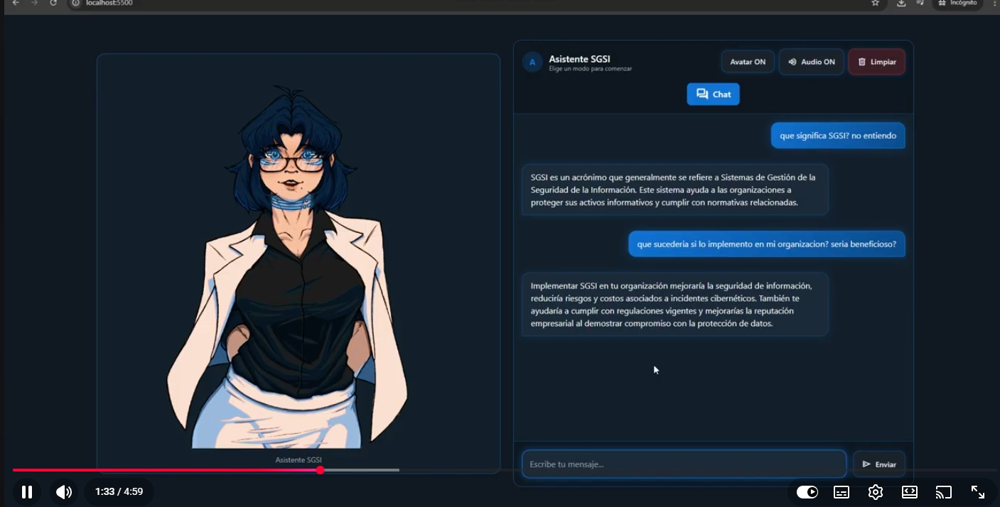

# 🤖 Chatbot SGSI – Fullstack AI Project

## 📌 Descripción General

Aplicación de chatbot orientada a Sistema de Gestión de Seguridad de la Información (SGSI), desarrollada con arquitectura **Backend + Frontend desacoplada**, con soporte para ejecución en **GPU (CUDA 12.8)** o CPU.

El proyecto demuestra:

- Integración de modelos LLM locales
- Optimización con GPU NVIDIA
- Diseño de API REST con FastAPI
- Separación cliente-servidor
- Exposición segura mediante túnel
- Despliegue frontend en producción

---

## 🌐 Demo

Frontend desplegado en producción (APAGADO):  
👉 https://frontend-chatbot-sgsi-akfe.vercel.app

---

## 🎬 Demo en Video

  

🔗 También puedes verlo aquí:  
https://www.youtube.com/watch?v=VSBb1X3VN8Q&t=1s

---

## 🏗 Arquitectura del Proyecto

### 🔹 Backend  
Repositorio:  
👉 https://github.com/rodritorneos-code/chatbotSGSI-Backend 

**Tecnologías principales:**
- FastAPI  
- Uvicorn  
- llama-cpp-python (CUDA 12.8)  
- Modelos GGUF  
- API REST  

---

### 🔹 Frontend  
Repositorio:  
👉 https://github.com/rodritorneos-code/chatbotSGSI-Frontend

**Tecnologías principales:**
- HTML  
- JavaScript  
- Consumo de API vía HTTP  
- Despliegue en Vercel  

---

## 🧠 Decisiones Técnicas

- Separación frontend/backend para escalabilidad y mantenimiento.
- Uso de formato GGUF para eficiencia en memoria.
- Implementación de soporte CUDA para reducir latencia de inferencia.
- Backend local expuesto mediante túnel seguro para integración con frontend desplegado.

---

## ⚙️ Ejecución

Las instrucciones completas de instalación y ejecución están documentadas en cada repositorio:

- Backend → sección "Instalación"
- Frontend → sección "Ejecución"

---

## 📈 Características Destacadas

✔ Arquitectura fullstack desacoplada  
✔ Soporte GPU y CPU  
✔ Integración de LLM locales  
✔ Frontend desplegado en producción  
✔ Exposición segura mediante túnel  

---

## 📜 Licencia

El código fuente de este proyecto está bajo la licencia **MIT**.

La ilustración del avatar utilizada en el frontend no está incluida dentro de la licencia MIT.

---

## 🎨 Créditos

Ilustración del avatar creada por:  
**Gabo .¿**  
Twitter: https://x.com/GaboAsies_Bv

Utilizada con permiso del autor.  
© 2026 Gabo .¿. Todos los derechos reservados.

---

## 👨‍💻 Autor

Rodrigo Alexander Pinto Niño
